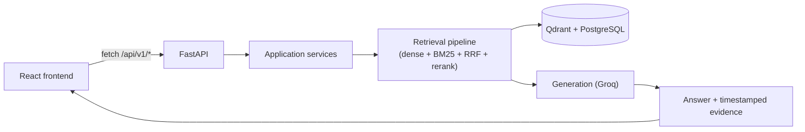

<div align="center">

<h1>yt researcher</h1>

<p>
  
  
  
  
  
  
  
  
  
  
  
  
  
  
</p>

<p>
  <em>
    Turn any YouTube video into an interactive research workspace. Paste a link,
    ask questions in plain language, and get grounded answers backed by the
    relevant transcript passages and timestamps.
  </em>
</p>

<p>
  A full-stack RAG system built around transcript ingestion, hybrid retrieval,
  reranking, grounded generation, and timestamped evidence.
</p>

</div>

## How it works



A pasted URL is fetched, its transcript reconstructed into sentences, and split into two
chunk sizes: small "child" chunks that get embedded and searched, and larger "parent"
chunks the LLM actually reads for context. A question runs dense (Qdrant) and keyword
(BM25) retrieval in parallel, fuses the results with reciprocal rank fusion, reranks them
with a cross-encoder, and — only if the top score clears a confidence threshold — builds
an answer from the retrieved transcript text. Below that threshold the app says so
instead of guessing.

Full details, including the indexing lifecycle, retrieval funnel, and the data each store
holds, are in [`docs/ARCHITECTURE.md`](docs/ARCHITECTURE.md).

---

## Key Features

- Paste a YouTube URL and get a searchable index of its transcript; re-analysing the same
  video reuses the existing index instead of rebuilding it.
- Ask questions in plain language and get answers grounded in the transcript, with
  timestamped evidence quoted alongside each one.
- Click a piece of evidence to jump the in-app player to that exact second — no tab
  switching to YouTube.
- Hybrid retrieval (dense + BM25, fused with RRF, then cross-encoder reranked) with a
  confidence gate that declines to answer rather than hallucinate when nothing relevant
  is found.
- Research history stored per browser, with per-video question counts and a one-click
  reset of all indexed data.
- Light/dark/system theming that persists and never flashes on reload.

---

## Quickstart

Everything runs from the repository root. One `.env`, one command.

```bash
cp .env.example .env     # then fill in your keys
npm install              # root launcher deps (concurrently)
npm run setup            # installs frontend + backend dependencies
npm run migrate          # creates the parent_chunks table
npm run dev              # starts both servers
```

```text
npm run dev
   |-- web  -> http://localhost:5173   (Vite, strictPort)
   |-- api  -> http://localhost:8000   (uvicorn --reload)
```

Postgres and Qdrant must be reachable at the URLs in your `.env` before starting. Open
`http://localhost:5173`; interactive API docs are at `http://localhost:8000/docs`.

Ctrl+C stops both. To run just one half: `npm run dev:frontend` or `npm run dev:backend`.

### Ports

These two ports are a fixed contract, not defaults to drift from:

| Service  | Port   | Declared in                                                                                      |
| -------- | ------ | ------------------------------------------------------------------------------------------------ |
| Frontend | `5173` | `yt_frontend/vite.config.ts` (`strictPort: true` - it fails rather than silently moving to 5174) |
| Backend  | `8000` | the `dev:backend` script in the root `package.json` (`--port 8000`)                              |

`VITE_API_BASE_URL` and `CORS_ALLOW_ORIGINS` in the root `.env` must agree with them. If you
change a port, change it in those three places.

---

## Project Structure

```
yt_researcher/
├── yt_backend/              # Python backend (FastAPI)
│   ├── src/
│   │   ├── api/                 # HTTP endpoints
│   │   ├── ingestion/           # Fetches transcripts from YouTube
│   │   ├── processing/          # Cleans text and reconstructs sentences
│   │   ├── chunking/            # Splits content into context and retrieval chunks
│   │   ├── embeddings/          # Vector representations of chunks
│   │   ├── vectorstore/         # Qdrant collection management and search
│   │   ├── parentstore/         # Parent-chunk lookup for context expansion
│   │   ├── retrieval/           # Hybrid search, RRF fusion, reranking
│   │   ├── generation/          # Answer synthesis from retrieved evidence
│   │   ├── database/            # Persistence layer
│   │   ├── models/              # Data shapes used throughout the pipeline
│   │   ├── services/            # Orchestrates the pipeline steps
│   │   ├── config/               # App settings and environment config
│   │   ├── container.py         # Dependency wiring
│   │   └── utility/              # Helpers (e.g. URL parsing)
│   ├── alembic/                 # Database migrations
│   └── main.py                  # App entry point
│
├── yt_frontend/             # React + TypeScript + Tailwind frontend
│   └── src/
│       ├── main.tsx             # Entry point: theme provider + router
│       ├── App.tsx              # Route table (shared layout route)
│       ├── routes/              # Route paths, builders and nav items
│       ├── screens/             # Home, Processing, Workspace, History, How It Works
│       ├── components/          # ui/, layout/, home/, processing/, video/, research/, history/
│       ├── hooks/                # useVideoIndexing, useVideoResearch, useHistory, ...
│       ├── services/             # api.ts (backend client), mappers.ts, storage.ts
│       └── types/                # Domain and API types
│
├── docs/
│   ├── ARCHITECTURE.md      # Full frontend + backend architecture
│   └── graphify-out/        # Generated codebase graph (AST-based, no LLM)
│
└── README.md
```

See [`docs/ARCHITECTURE.md`](docs/ARCHITECTURE.md#2-frontend-yt_frontend) for the
complete module map of both sides.

---

## Environment Configuration

A single `.env` at the repository root configures **both** applications. There is no `.env`
inside `yt_backend/` or `yt_frontend/`.

```bash
cp .env.example .env
```

|              |                                                                                                                                                                                                                                |
| ------------ | ------------------------------------------------------------------------------------------------------------------------------------------------------------------------------------------------------------------------------ |
| **Backend**  | Reads every non-`VITE_` key through pydantic-settings. `src/config/settings.py` anchors `env_file` to the repo root with an absolute path, so the server loads the same config regardless of the directory it is started from. |
| **Frontend** | Reads **only** `VITE_`-prefixed keys. `vite.config.ts` sets `envDir` to the repo root.                                                                                                                                         |

Vite inlines `VITE_*` variables into the public browser bundle, so **never give a secret a
`VITE_` name**. Every other key in the file is read by Vite and discarded - `GROQ_API_KEY`,
`DATABASE_URL` and `QDRANT_API_KEY` never reach the browser. Real process environment variables
still override the file, so deploys can inject config without one.

`.env` is git-ignored; `.env.example` is committed and carries placeholder values only.

Required: `GOOGLE_API_KEY`, `GOOGLE_EMBEDDING_MODEL`, `GROQ_API_KEY`, `GROQ_MODEL`,
`QDRANT_URL`, `DATABASE_URL`, `FRESHNESS_CHECK_DAYS`, `RRF_K`, `RETRIEVAL_CANDIDATE_LIMIT`,
`RETRIEVAL_FINAL_LIMIT`, `RERANKER_MODEL`, `RERANKER_MIN_SCORE`. Settings are validated at
startup, so a missing required value fails immediately with a clear error.

---

## Tech Stack

**Backend**

| Layer             | Technology                                                                                  |
| ----------------- | ------------------------------------------------------------------------------------------- |
| API framework     | FastAPI                                                                                     |
| Data validation   | Pydantic v2                                                                                 |
| Transcript source | youtube-transcript-api                                                                      |
| Token counting    | tiktoken (cl100k_base)                                                                      |
| Embeddings        | Google Gemini (`google-genai`)                                                              |
| Generation        | Groq (via `langchain-groq`)                                                                 |
| Vector store      | Qdrant                                                                                      |
| Retrieval         | Dense + BM25 keyword, fused with RRF, then reranked (`sentence-transformers` cross-encoder) |
| Relational store  | PostgreSQL (SQLAlchemy + psycopg), migrated with Alembic                                    |
| Package manager   | uv                                                                                          |
| Python            | 3.13+                                                                                       |

**Frontend**

| Layer              | Technology                                     |
| ------------------ | ---------------------------------------------- |
| Framework          | React 19                                       |
| Language           | TypeScript 5.7                                 |
| Build tool         | Vite 6                                         |
| Styling            | Tailwind CSS v4 (`@tailwindcss/vite`)          |
| Routing            | react-router-dom 7 (shared layout route)       |
| Icons              | lucide-react                                   |
| Component variants | class-variance-authority, clsx, tailwind-merge |
| Tooling            | ESLint 10 (flat config) + Prettier             |

---

## Setup

### Prerequisites

- Node.js (for the frontend and the root launcher scripts)
- Python 3.13+ and [uv](https://docs.astral.sh/uv/)
- A reachable PostgreSQL instance
- A reachable Qdrant instance (local or cloud)
- A Google API key (Gemini embeddings) and a Groq API key (generation)

### Backend setup

```bash
cp .env.example .env      # at the repository root, then fill in your keys
pip install uv
npm run setup             # uv sync + frontend install
npm run migrate           # creates the parent_chunks table
npm run dev:backend       # uvicorn main:app --reload --port 8000
```

Running `uvicorn` by hand still works from anywhere, since config doesn't depend on the
working directory:

```bash
uv run --directory yt_backend uvicorn main:app --reload --port 8000
```

Other backend scripts, from the repo root: `npm run migrate` (Alembic upgrade). For
anything beyond that, use `uv run --directory yt_backend alembic ...` directly.

### Frontend setup

```bash
npm run dev:frontend     # from the repository root
```

Other scripts, from `yt_frontend/`:

```bash
npm run typecheck     # tsc --noEmit
npm run lint          # eslint .
npm run format        # prettier --write .
npm run build          # tsc --noEmit && vite build
npm run preview       # serve the production build
```

The frontend reads exactly one variable, from the root `.env`:

```env
VITE_API_BASE_URL=http://localhost:8000/api/v1
```

It carries the origin **and** the `/api/v1` version prefix. This value is **public** -
Vite inlines it into the browser bundle, so it must never carry a secret. The backend
must allow the frontend's origin: `CORS_ALLOW_ORIGINS` in the root `.env` covers
`http://localhost:5173` and `http://127.0.0.1:5173` by default.

### Start development

```bash
npm run dev
```

Starts both servers concurrently (`dev:backend` on `:8000`, `dev:frontend` on `:5173`).

### Verify

- Frontend: open `http://localhost:5173` — the landing page should load, and pasting a
  YouTube URL should move to the processing screen.
- Backend: `GET http://localhost:8000/health` should return `200`; interactive docs are
  at `http://localhost:8000/docs`.
- Running the frontend alone loads the landing page, but analysing a video reports the
  research service as unreachable until the backend is also running.

---

## API

All routes are prefixed with `/api/v1`, except the health check.

| Method | Path                 | Purpose                                                                  |
| ------ | -------------------- | ------------------------------------------------------------------------ |
| `GET`  | `/health`            | Service health check                                                     |
| `POST` | `/api/v1/index`      | Index a video, or reuse/rebuild an existing index                        |
| `POST` | `/api/v1/query`      | Ask a question and get a grounded answer with evidence                   |
| `POST` | `/api/v1/transcript` | Fetch and clean a video's transcript (inspection route)                  |
| `POST` | `/api/v1/chunks`     | Preview parent/child chunks (inspection route)                           |
| `POST` | `/api/v1/embeddings` | Preview child vectors (inspection route)                                 |
| `POST` | `/api/v1/reset`      | Development only — clears all indexed data. Requires `{"confirm": true}` |

Example, fetch a transcript:

```
POST /api/v1/transcript
{ "url": "https://www.youtube.com/watch?v=VIDEO_ID" }
```

```json
{
  "video_id": "VIDEO_ID",
  "sentence_count": 42,
  "sentences": [
    {
      "text": "...",
      "start": 18.5,
      "end": 22.3,
      "index": 0,
      "source_segments": [0, 1, 2]
    }
  ]
}
```

Error responses: `400` (not a valid YouTube link), `404` (video not found), `422` (no transcript
available).

For the full request/response contract, error handling, and what each endpoint does
internally, see [`docs/ARCHITECTURE.md#37-api-endpoints`](docs/ARCHITECTURE.md#37-api-endpoints).

---

## Graphify — Project Visualization

[Graphify](https://graphify.dev) generates an interactive, AST-based dependency graph of the
codebase — no LLM involved. The output lives under `docs/graphify-out/` and is committed so you
can browse it without re-running the tool.

### Prerequisites

Graphify must be installed and available globally in your terminal:

```bash
npm install -g graphify-codebase
```

Verify the install: `graphify --version`.

### Generate (or regenerate) the graph

From the **repository root**:

```bash
graphify .
```

This writes (or updates) all output files under `docs/graphify-out/`.

### View the interactive graph

Open `docs/graphify-out/graph.html` in a browser — it will not render as an interactive graph
inside the VS Code text editor.

```bash
# Windows — open directly from the terminal
start .\docs\graphify-out\graph.html
```

On macOS/Linux: `open docs/graphify-out/graph.html`

### Call-flow visualization

```bash
graphify export callflow-html
```

This generates or updates `docs/graphify-out/docs-callflow.html`. Open it in a browser the
same way.

### Other files in `docs/graphify-out/`

| File                    | Description                                     |
| ----------------------- | ----------------------------------------------- |
| `graph.html`            | Interactive module-dependency graph             |
| `docs-callflow.html`    | Call-flow visualization                         |
| `graph.json`            | Raw graph data (nodes + edges)                  |
| `GRAPH_REPORT.md`       | Human-readable summary of the graph analysis    |
| `community-labels.json` | Community/cluster labels derived from the graph |

---

## Documentation

| Doc                                            | Covers                                                                                                                                                                            |
| ---------------------------------------------- | --------------------------------------------------------------------------------------------------------------------------------------------------------------------------------- |
| `README.md`                                    | This file — project overview, setup, and everyday commands.                                                                                                                       |
| [`docs/ARCHITECTURE.md`](docs/ARCHITECTURE.md) | Full frontend + backend architecture: layers, indexing and query flows, data stores, API contract.                                                                                |
| [`docs/graphify-out/`](docs/graphify-out/)     | Generated Graphify project graph — open `graph.html` or `docs-callflow.html` in a browser, or read `GRAPH_REPORT.md`. Run `graphify .` from the repository root to regenerate it. |

---

## Development Notes

- No automated test suite on either side. Verification is typecheck, lint, a production
  build, and a manual pass over `/reset` → `/index` → `/query` against a real video.
- The frontend has no data-fetching or state library — `useSyncExternalStore` plus a
  typed `fetch` wrapper covers the one piece of shared state (history).
- Backend configuration is validated eagerly at startup (`pydantic-settings`), so a
  missing or malformed `.env` value fails immediately instead of on first request.

---
