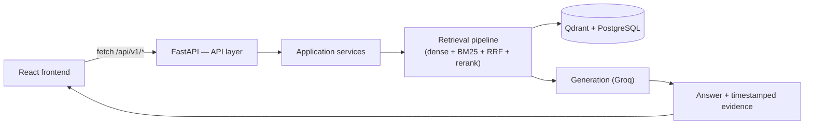
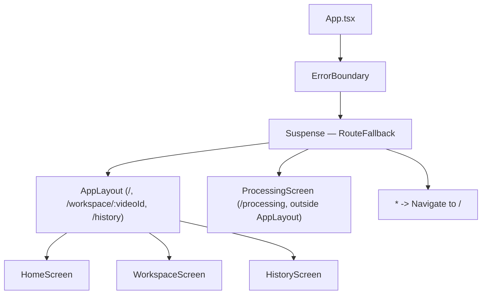
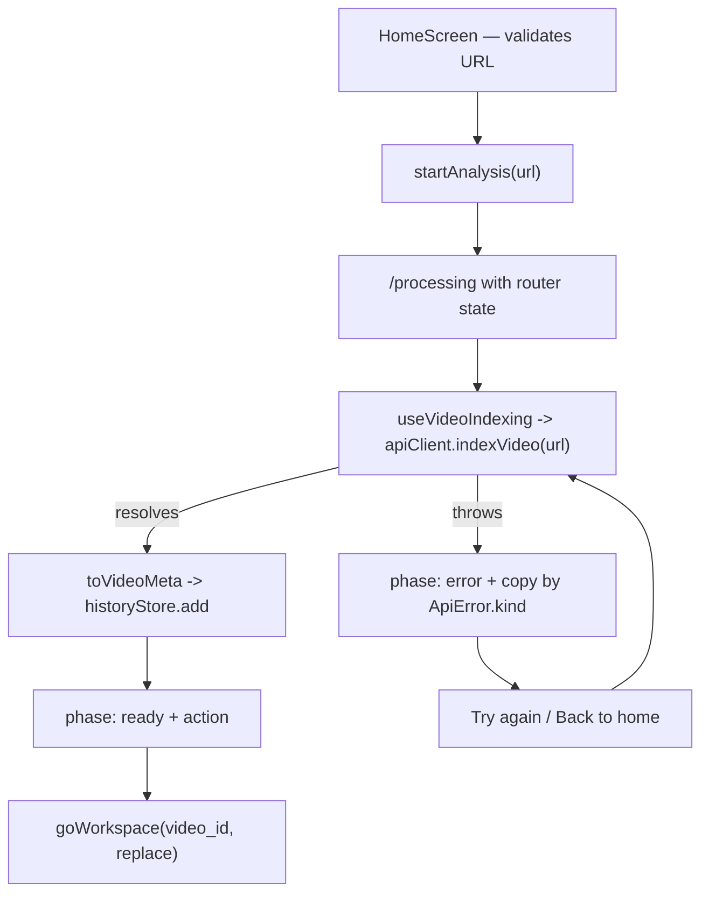
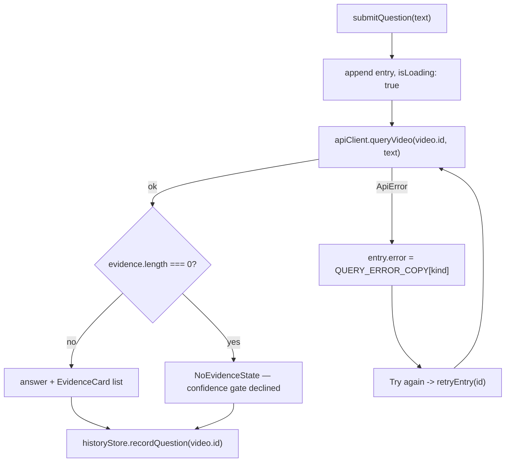
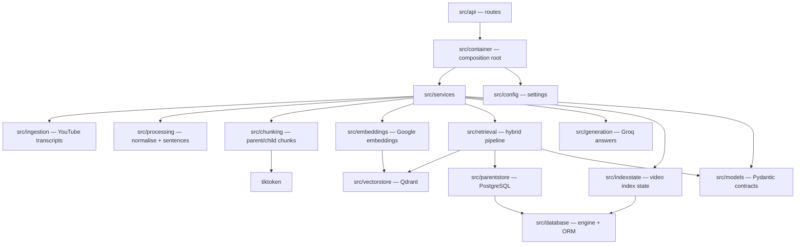
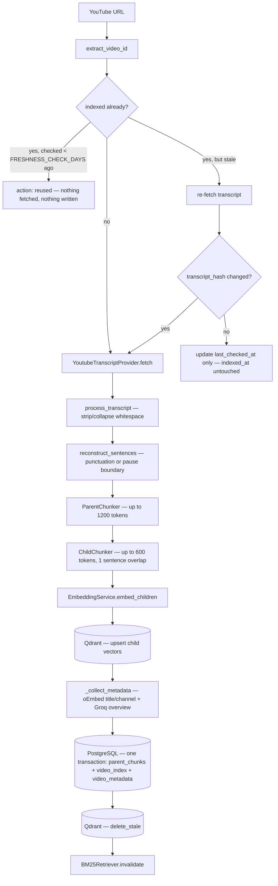
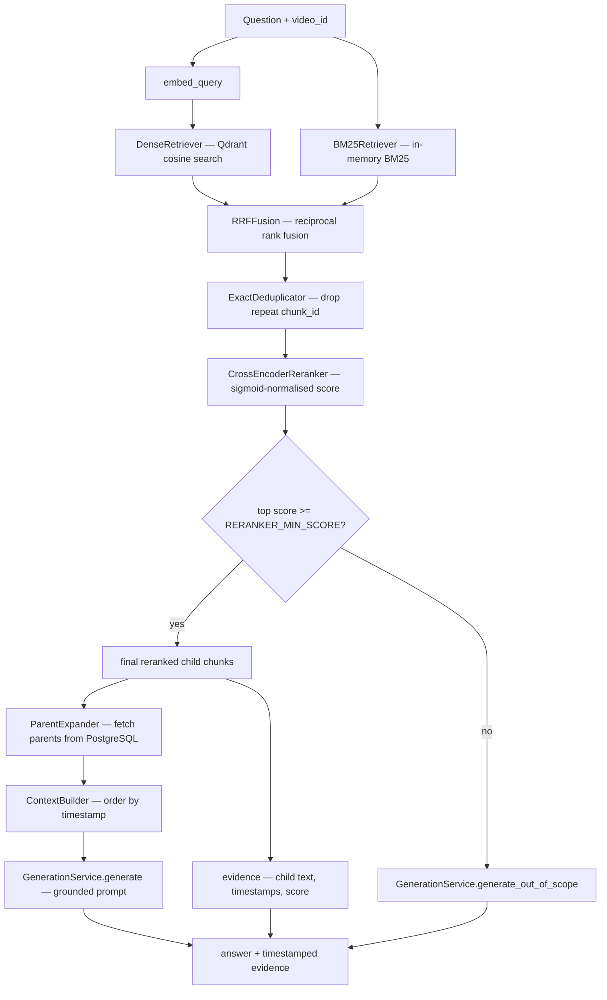

# Architecture

Single source of truth for how `yt_researcher` is built: a React client, a FastAPI
backend, and the hybrid retrieval pipeline that sits between a pasted YouTube URL and a
grounded, timestamped answer.

This document describes the code as it exists today. Nothing here is aspirational — if a
component isn't implemented, it isn't listed.

For a generated, queryable map of the actual codebase (modules, call graph, hub
components), see [`graphify-out/`](./graphify-out/) — produced by running
[graphify](https://github.com/safishamsi/graphify)'s AST extraction over the repo. It's a
useful cross-check: the "God Nodes" it finds independently (`RetrievedChunk`,
`IndexingService`, `PostgresIndexStateStore`, `ParentChunk`, `TranscriptService`) line up
with the core abstractions described below.

---

## 1. High-level flow

The repo has two halves that only ever talk over HTTP: `yt_frontend` never reads a
database or a vector store directly, and `yt_backend` has no knowledge of how its
responses are rendered. `src/services/api.ts` on the frontend and `src/api/` on the
backend are the entire integration surface.

---

## 2. Frontend (`yt_frontend`)

React 19 + TypeScript + Tailwind v4 client. Every screen runs on real backend data —
there is no demo mode and no mock data in the runtime path.

### 2.1 Layers

| Layer | Package | Responsibility |
|---|---|---|
| Entry | `src/main.tsx` | Mounts React, wraps the app in `ThemeProvider` and `BrowserRouter`. |
| Routing | `src/App.tsx`, `src/routes/` | Lazy route table behind one error boundary and one Suspense fallback. |
| Layout | `src/components/layout/` | Navbar, page shell, `ErrorBoundary`, `RouteFallback`. |
| Screens | `src/screens/` | One component per route; compose feature components. |
| Feature components | `src/components/{home,processing,research,video,history,how-it-works}/` | Rendering for one product area. Receive data and callbacks as props. |
| UI primitives | `src/components/ui/` | `Button`, `Card`, `Badge`, `Field`, `Input`, `Skeleton`, `Drawer` — cva variants, no domain knowledge. |
| Hooks | `src/hooks/` | Where state and behavior live: `useVideoIndexing`, `useVideoResearch`, `useHistory`, `useDataReset`, `useAppNavigation`. |
| Services | `src/services/` | `api.ts` (the only `fetch`), `mappers.ts` (the only wire→domain translation), `storage.ts` (the only `localStorage`). |
| Types | `src/types/` | `api.ts` (wire contracts), `index.ts` (domain models). |
| Lib | `src/lib/` | `env.ts`, `constants.ts`, `utils.ts`, `theme.tsx`. |

Dependency direction is one-way: **screens → feature components → hooks → services**. No
component calls `fetch`, reads `localStorage`, or builds a backend request directly.

### 2.2 Routing

`/processing` sits outside `AppLayout` so it stays chrome-free. Unknown paths and an
unresolvable `/workspace/:videoId` redirect to `/`. All four screens (plus
`/how-it-works`, a static documentation page with no API calls) are `React.lazy` behind
one `<Suspense>`, so only the visited route's chunk downloads. All navigation intents
live in `useAppNavigation` — the only `useNavigate()` call site.

### 2.3 API layer and the mapping point

`src/services/api.ts` (`ApiClient`) is the only module that calls `fetch`. It exposes
three routes:

| Call | Endpoint |
|---|---|
| `indexVideo(url)` | `POST /index` |
| `queryVideo(videoId, question)` | `POST /query` |
| `resetApplicationData()` | `POST /reset` |

The base URL is `VITE_API_BASE_URL` (default `http://localhost:8000/api/v1`), read from
the **root** `.env` — `vite.config.ts` sets `envDir` one level above the Vite project so
both apps share one file, and only `VITE_`-prefixed keys are inlined into the bundle.

Every failure becomes a typed `ApiError` with a kind (`network`, `invalid_url`,
`no_transcript`, `bad_request`, `server`), classified from the backend's `error` field
first and the HTTP status second. No backend message or status code ever reaches a
screen directly — hooks map the kind to copy in `lib/constants.ts`.

`src/services/mappers.ts` is the single translation between wire and domain types.
`toVideoMeta` resolves every divergence between the backend's `IndexResponse` and the
frontend's `VideoMeta` (renames `overview` → `summary`, derives `thumbnail` from the
video id, formats `duration`, carries forward `questionCount`/`lastResearched` from
existing history). `toEvidenceChunks` preserves the backend's reranker order and buckets
the 0–1 `relevance_score` into a relevance label.

### 2.4 Indexing flow (client side)

`/index` is one synchronous call that reports no progress, so `ProcessingStages` shows
the seven backend stages as an expected sequence with a single indeterminate skeleton
bar rather than a fake percentage. `action` (`indexed` / `reused` / `rebuilt`) only
changes the confirmation copy — all three land in the same workspace. A failed index
writes nothing to history.

### 2.5 Research workspace (query flow)

A failure is scoped to the entry that produced it — `retryEntry` re-runs only that
question, so one bad request never disturbs answers already in the thread. Playback
happens inside the workspace (a `youtube-nocookie` embed seeked to the chunk's own
timestamp), not by linking out to YouTube.

`EvidenceCard` renders exactly what `/query` returned for one reranked child chunk: the
relevance badge, the `start–end` range, and a "Watch from `{start}`" button. Evidence is
never fetched separately or regenerated — the same reranked children that build the
model's context are the ones shown, in the same order.

### 2.6 History

`historyStore` (`useSyncExternalStore` over `localStorage`) is the only history store.
Reset is two-store and ordered: `useDataReset` clears the backend first via `/reset` and
only drops local history once the backend confirms, so a failed reset never leaves the
UI claiming videos that are still indexed server-side. History is purely client-side —
`/workspace/:videoId` only resolves for videos indexed from that browser.

### 2.7 Error and loading states

| Situation | Behavior |
|---|---|
| Invalid YouTube URL | Inline validation, submit disabled |
| Backend unreachable | Retry-able error copy, no raw message shown |
| Video has no transcript | Retry-able error copy specific to that case |
| Confidence gate declined | `NoEvidenceState` — a real backend outcome, not an error |
| Unresolvable `/workspace/:videoId` | Redirect home |
| Render crash | `ErrorBoundary` fallback with a link home |
| `localStorage` unavailable | Every `storage.ts` access is `try/catch`ed; session continues without persistence |

### 2.8 Design system

`src/index.css` layers brand primitives → semantic color roles (light on `:root`, dark on
`.dark`) → a Tailwind `@theme inline` binding, so `bg-surface` compiles to a CSS variable
and the whole app flips with one class. Dark mode is a hand-tuned palette, not an
inversion. Components carry no raw hex values or inline font sizes.

### 2.9 Known limitations

| Limitation | Why it stands |
|---|---|
| A workspace URL only opens in the browser that indexed the video | History is client-side by design |
| No automated tests | Verification is typecheck, lint, production build, and a manual pass over `/reset` → `/index` → `/query` |
| Indexing a long video blocks on one request with no progress detail | The backend exposes no intermediate progress |
| Broad questions are often declined | The backend's confidence gate is deliberately strict |

---

## 3. Backend (`yt_backend`)

FastAPI service that turns a YouTube URL into a searchable, citable knowledge base: it
fetches the transcript, reconstructs sentences, builds hierarchical chunks, embeds them,
and answers questions with hybrid retrieval grounded in timestamped evidence.

### 3.1 Layers

The codebase is organized in strict layers. Dependencies point downward only.

| Layer | Package | Responsibility |
|---|---|---|
| HTTP | `src/api/` | Parse request, call a service, return response. No business logic. |
| Composition | `src/container.py` | Builds and `lru_cache`s every concrete implementation. |
| Application | `src/services/` | Orchestrates one use case end to end. |
| Domain capability | `src/ingestion/`, `src/processing/`, `src/chunking/`, `src/embeddings/`, `src/retrieval/`, `src/generation/` | One capability each, behind an interface. |
| Persistence | `src/vectorstore/`, `src/parentstore/`, `src/indexstate/`, `src/database/` | Talks to Qdrant and PostgreSQL. |
| Contracts | `src/models/` | Pydantic models shared across layers. |
| Config | `src/config/settings.py` | Typed settings, validated at startup. |

`src/container.py` is the only module that knows which concrete class backs each
interface. Every factory is `lru_cache`d, so expensive resources — the Qdrant client, the
SQLAlchemy engine, the cross-encoder model — are built once per process. Routes receive
them through FastAPI `Depends()`, so nothing is constructed at import time.

### 3.2 Module dependencies

### 3.3 Indexing lifecycle

`POST /api/v1/index` makes a video searchable. A video is indexed once; repeat requests
reuse the existing index instead of re-running the pipeline.

**Freshness, not expiry.** `FRESHNESS_CHECK_DAYS` is how often the transcript is
re-checked, never an assertion that it changed. A stale check re-fetches and hashes the
reconstructed sentence text; an unchanged hash moves `last_checked_at` only, so
`indexed_at` still records when the searchable data was last actually built. The hash
covers sentence text only — auto-caption timestamps jitter between fetches without the
content changing.

**Ordering protects a working index.** Everything that can fail — transcript fetch,
embedding — runs before anything is replaced. Vectors are upserted while the old ones
are still in place, and the PostgreSQL transaction is the commit point: it swaps the
parent chunks and marks the video ready together, or rolls back. A failed rebuild leaves
the old parents, vectors, hash and `indexed_at` intact, records the error in
`video_index.last_error`, and the request falls back to serving the still-working index
— reported as `action: "reused"`, indistinguishable from a genuine reuse in the response.

**Stale vectors are pruned, not overwritten.** Chunk IDs are positional, so a rebuild
producing fewer chunks would strand surplus points where the `video_id` filter still
finds them. `delete_stale` removes exactly the chunk IDs the new build no longer
contains, after the swap has committed.

**Two chunk sizes, two jobs.** Children are what get embedded and searched (small,
precise); their parents are what the LLM actually reads (larger, coherent). Small chunks
retrieve precisely but read poorly; large chunks read well but retrieve imprecisely.

**Metadata never blocks indexing.** `_collect_metadata` makes two calls the retrieval
pipeline does not need — YouTube's oEmbed endpoint for title/channel, and a Groq call for
a short overview — and swallows its own failures, returning `None` fields rather than
raising.

### 3.4 Query / retrieval pipeline

`POST /api/v1/query` answers a question about one indexed video.

Each retriever returns `RETRIEVAL_CANDIDATE_LIMIT` chunks; after fusion, deduplication
and reranking, `RETRIEVAL_FINAL_LIMIT` survive into the context.

**The confidence gate is the anti-hallucination control.** If the reranker's best score
falls below `RERANKER_MIN_SCORE`, no context is built and the question is answered with
an out-of-scope prompt that explicitly forbids answering from general knowledge. A
grounded answer can only be produced from retrieved transcript text.

**The reranked children feed both branches.** Their parent IDs drive the context
expansion the model reads; the children themselves are returned as evidence, in reranker
order, at their own timestamps. Nothing is retrieved twice, so the answer and the
evidence shown beside it always come from one ranking.

**Reranker scores are normalised.** The ms-marco cross-encoder emits unbounded logits;
`CrossEncoderReranker` squashes them through a sigmoid so `RERANKER_MIN_SCORE` and the
API's `relevance_score` sit on a comparable 0–1 scale.

### 3.5 Data stores

| Store | Holds | Written by | Read by |
|---|---|---|---|
| Qdrant | Child chunk vectors + payload, filtered by `video_id` | `QdrantVectorStore.add_chunks` / `delete_stale` | `DenseRetriever`, `BM25Retriever` |
| PostgreSQL `parent_chunks` | Parent chunk text and timestamps | `PostgresIndexStateStore.commit_rebuild` | `ParentExpander` |
| PostgreSQL `video_index` | Per-video status, `transcript_hash`, `indexed_at`, `last_checked_at`, `last_error` | `PostgresIndexStateStore` | `IndexingService` |
| PostgreSQL `video_metadata` | Title, channel, duration, language, overview | `PostgresIndexStateStore.commit_rebuild` | `IndexingService` |

PostgreSQL owns everything video-level; Qdrant carries only what retrieval needs, so
title and overview are not duplicated into every child vector's payload. Schema lives in
`src/database/models.py`, migrated with Alembic (`alembic/versions/`).
`BM25Retriever` builds its keyword index in memory by scrolling every chunk for a video
out of Qdrant, then caches it per `video_id`; `IndexingService` invalidates that cache
after a rebuild.

**Concurrency.** `PostgresIndexStateStore.lock` takes a session-level `pg_advisory_lock`
keyed on the video ID, so two requests to index the same new video cannot both run the
embedding pipeline — the second waits and finds the index ready. The lock is only taken
when work might actually happen; a request for an already-fresh video is served from a
single read with no lock.

### 3.6 Interfaces and implementations

| Interface | Implementation |
|---|---|
| `TranscriptProvider` | `YoutubeTranscriptProvider` |
| `EmbeddingProvider` | `GoogleEmbeddingProvider` |
| `GenerationProvider` | `GroqGenerationProvider` |
| `VectorStore` | `QdrantVectorStore` |
| `ParentStore` | `PostgresParentStore` |
| `KeywordRetriever` | `BM25Retriever` |
| `ResultFusion` | `RRFFusion` |
| `Deduplicator` | `ExactDeduplicator` |
| `Reranker` | `CrossEncoderReranker` |
| `ConfidenceChecker` | `RerankerConfidenceChecker` |
| `Chunker[T]` | `ParentChunker`, `ChildChunker` |

`DenseRetriever`, `ParentExpander`, `ContextBuilder` and `PostgresIndexStateStore` are
concrete classes with no interface — there's one sensible way to do each.

### 3.7 API endpoints

All routes are prefixed with `/api/v1`, except the health check.

| Method | Path | Purpose |
|---|---|---|
| `GET` | `/health` | Liveness check. |
| `POST` | `/api/v1/index` | Index a video, or reuse/rebuild an existing index. Returns `action`: `indexed`, `reused` or `rebuilt`. |
| `POST` | `/api/v1/query` | Ask a question about an indexed video. Returns an answer plus timestamped evidence. |
| `POST` | `/api/v1/transcript` | Return reconstructed sentences for a URL. Stores nothing. Inspection route. |
| `POST` | `/api/v1/chunks` | Preview parent/child chunks for a URL. Stores nothing. Inspection route. |
| `POST` | `/api/v1/embeddings` | Preview child vectors for a URL. Stores nothing; consumes API quota. Inspection route. |
| `POST` | `/api/v1/reset` | Development only. Clears all indexed data and caches. Requires `{"confirm": true}`. |

`/transcript`, `/chunks` and `/embeddings` exist for tuning the pipeline and have no
frontend client. `/index` and `/query` are the product surface. `/reset` has one client
— the History screen's reset drawer — but is a destructive dev utility, not part of the
core flow. There is deliberately no refresh endpoint: `/index` decides on its own whether
to reuse, re-check or rebuild.

`/reset` clears the three PostgreSQL indexing tables, every point in the Qdrant
collection, and the in-memory BM25 cache — schema and migrations are left in place. The
stages run PostgreSQL → Qdrant → BM25 and cannot be committed together, so a failure
raises `ResetFailed` and reports which stages already completed.

### 3.8 Error handling

Domain errors (`InvalidYouTubeURL`, `TranscriptNotAvailable`, `VideoNotFound`,
`ResetFailed`) are defined in `src/api/exceptions.py` and translated to HTTP responses
(400, 422, 404, 500) by handlers in `main.py`. Each carries a machine-readable `error`
field alongside `detail` — that field, not the status code, is what a client should
branch on, since FastAPI's own validation failures also return 422 but with no `error`
field. Stack traces are never returned to clients.

### 3.9 CORS

`main.py` registers `CORSMiddleware` with the origins listed in `CORS_ALLOW_ORIGINS`
(comma separated, defaulting to the Vite dev server on port 5173). This is the only part
of the backend the frontend integration required — which is why `vite.config.ts` pins
`strictPort: true`: if Vite silently moved to 5174, every request would start failing
CORS.

### 3.10 Configuration

All settings are declared in `src/config/settings.py` and loaded once via
`get_settings()`; any field without a default is required, so a missing value fails at
startup rather than mid-request. Configuration lives in a single `.env` at the
**repository root**, shared with the frontend — `settings.py` derives `REPO_ROOT` from
its own file location so the backend loads identically regardless of the working
directory it's launched from. `extra="ignore"` lets it skip the frontend's `VITE_*` key
in that same file.

---

## 4. The frontend/backend contract

`yt_frontend` consumes three routes — `/index`, `/query`, `/reset` — and nothing else.
Three properties of the API are what the client is built around:

- **`/index` is synchronous with no intermediate progress.** The client presents the
  pipeline stages as an expected sequence, not measured progress.
- **`action` distinguishes `indexed` / `reused` / `rebuilt`**, but all three return a
  usable index, so the client varies only the wording. It cannot detect a rebuild that
  failed over a working index — that case also reports `reused`.
- **A declined answer is a 200 with a non-empty `answer` and an empty `evidence` list.**
  There's no `declined` flag; `evidence == []` is the signal, and it's exact, because the
  confidence gate guarantees a grounded answer carries at least one child chunk.

`relevance_score` is on a 0–1 scale, which is what lets the client bucket it into a label
without rescaling. Every `metadata` field except `video_id` is nullable — metadata
lookup is best-effort and must never block indexing — and on the `reused` path
`metadata` itself can be `null` if the row is missing.

One gap worth naming: `/query` for a `video_id` that was never indexed is not an error.
Both retrievers come back empty, the gate declines, and the response looks identical to
an indexed video being asked something irrelevant — the client cannot tell the two apart.

---

## 5. Generated codebase graph

[`docs/graphify-out/`](./graphify-out/) contains a [graphify](https://github.com/safishamsi/graphify)
AST-based extraction of the repository — deterministic, no LLM involved.

| File | What it is |
|---|---|
| `graph.json` | Raw node/edge graph (891 nodes, 2128 edges, 59 communities) for programmatic queries. |
| `graph.html` | Interactive force-directed visualization — open directly in a browser. |
| `docs-callflow.html` | Mermaid-based architecture/call-flow view, grouped by community. |
| `GRAPH_REPORT.md` | Plain-language audit: god nodes, cross-community bridges, and questions the graph can answer. |
| `community-labels.json` | Human-assigned names for each detected community (derived from dominant module path per cluster). |

It was generated with `graphify extract . --code-only`, which skips LLM-based semantic
extraction entirely and relies on structural (AST) analysis of the Python and
TypeScript source. Re-run it after a significant refactor to keep it current.
